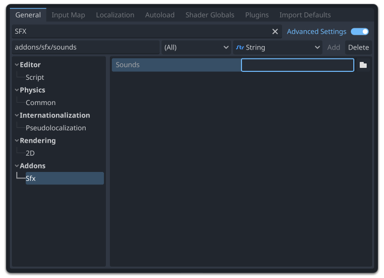

# SFX Plugin for Godot

<div align="center">
  
</div>

⚠️ I haven't officially "released" this yet, so some thing may change a lot.

## Installation
- Install the plugin in the Addons folder
- Enable it in `Project Settings > Addons`

## Setup



1. Go to `Project > Project Settings...`
2. Turn on "Advanced Settings"
3. In the list, go to `Addons > SFX` or search for "SFX"
4. For the sounds directory, choose a folder where all your sounds will live.

## Usage

### Playing sounds
```gdscript
# Play a sound at a location
SFX.play_at_location("water_splash", Vector3(10, 20, 30))

# Play a sound at attached to a node
SFX.play_attached_to_node("footstep", player)

# Play a non-spatial sound that is not affected by process mode
SFX.play_everywhere("ui_select")
```

### Random sounds
If you include sounds with file names that end with numbers, `SFX` can randomly
choose one and play it.

For example, in my sounds directory I include the following files:

```txt
res://audio/sfx/footstep_1.wav
res://audio/sfx/footstep_2.wav
res://audio/sfx/footstep_3.wav
```

Then when playing the sound, replace the number in the sound name with `[%n]`:

```gdscript
SFX.play_attached_to_node("footstep_[%n]", player)
```

## Demo

[Download demo project](#)

### Credits

| Name | Link |
|---|---|
| chime.wav | [582649__ironcross32__long-rising-tones-14.wav](https://freesound.org/people/ironcross32/sounds/582649/) |
| wobble.wav | [268613__breo2012__pulse-bass.wav](https://freesound.org/people/breo2012/sounds/268613/) |
| boot_1.wav | [533044__nox-sound__footsteps-boots-wood.wav](https://freesound.org/people/Nox_Sound/sounds/533044/) |
| boot_2.wav | [533044__nox-sound__footsteps-boots-wood.wav](https://freesound.org/people/Nox_Sound/sounds/533044/) |
| boot_3.wav | [533044__nox-sound__footsteps-boots-wood.wav](https://freesound.org/people/Nox_Sound/sounds/533044/) |
